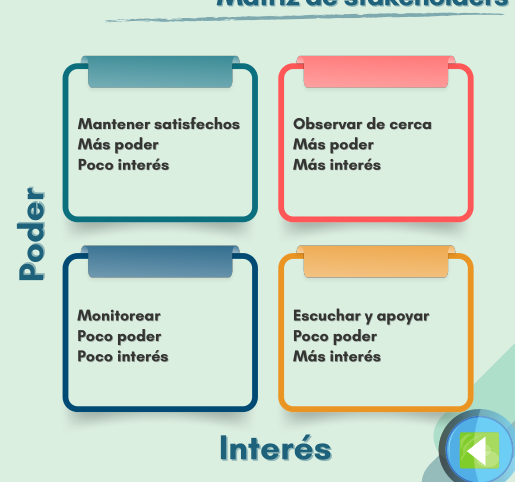
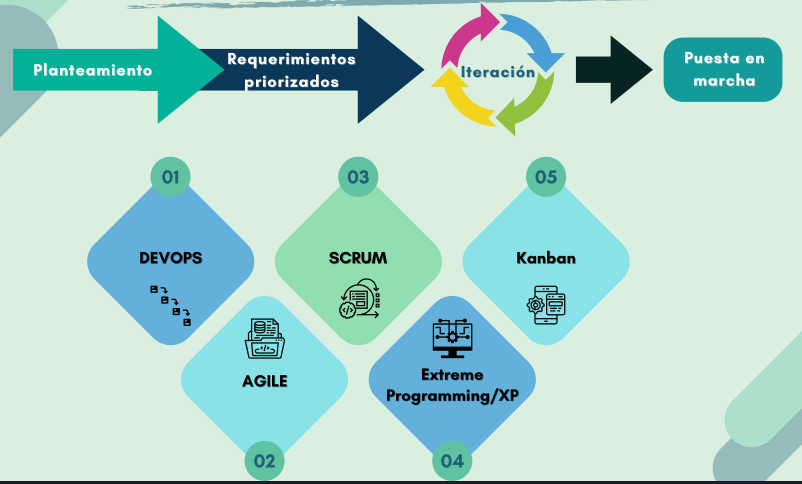
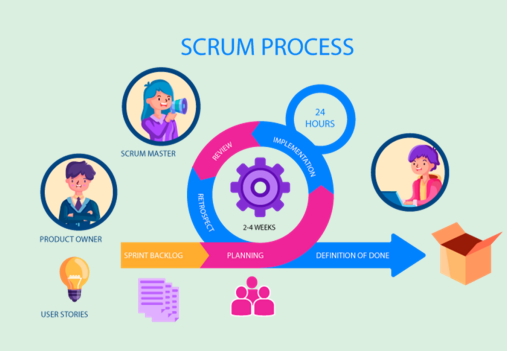
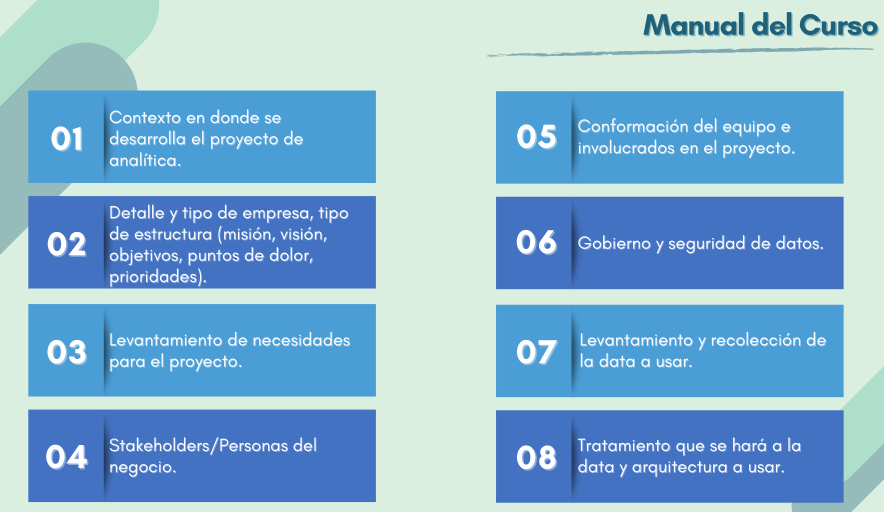

## Metodologías de presentación de proyectos

### Scrum

1. Framewok adaptable y flexible
2. Enfoque en la colaboración y comunicación
3. transparencia y visibilidad del progreso
4. Iteraciones cortas (sprints)
5. Ambiente de responsabilidad compartida.

### ASUM-DM

1. Bussines understanding: Entedimiento del negocio es fundamental para el éxito del proyecto
2. Analytic approach: Profiling de datos, selección de técnicas analíticas, definición de métricas de éxito
3. Data requirements: Entendimiento de los datos necesarios para el proyecto, identificación de fuentes de datos, evaluación de la calidad de los datos
4. Data collection: Preparación y recopilación de los datos necesarios para el proyecto, asegurando la calidad y la integridad de los datos.
5. Data understanding: Análisis exploratorio de los datos, identificación de patrones y tendencias, evaluación de la calidad de los datos.
6. Data preparation : Limpieza, transformación y preparación de los datos para el análisis, asegurando que los datos estén en un formato adecuado para el modelado.
7. Modeling: Selección y aplicación de técnicas de modelado adecuadas para el proyecto, evaluación de los modelos y selección del mejor modelo para el proyecto.
8. Evaluation: Evaluación del modelo seleccionado, validación de los resultados y comparación con las métricas de éxito definidas en la fase de análisis.
9. Deployment: Implementación del modelo en un entorno de producción, monitoreo del rendimiento del modelo y mantenimiento continuo para asegurar su efectividad a lo largo del tiempo.
10. Feedback: Recopilación de retroalimentación de los usuarios y partes interesadas, evaluación del impacto del modelo en el negocio y ajuste continuo del modelo para mejorar su rendimiento y efectividad.

# Tema 4: Productos y servicios

Identificar si se ofrecen productos o servios o los dos

- Productos: Tangibles, físicos, pueden ser almacenados y transportados. Ejemplo: un teléfono móvil, un automóvil, una computadora.
- Servicios: Intangibles, no pueden ser almacenados ni transportados. Ejemplo: un servicio de consultoría, un servicio de limpieza, un servicio de atención al cliente.
- Ambos: Muchas empresas ofrecen tanto productos como servicios. Ejemplo: una empresa de tecnología que vende dispositivos electrónicos (productos) y también ofrece soporte técnico (servicios).

# Tema 5: Procesos de Negocios

Conjunto de actividades o tareas interrelacionadas que se llevan a cabo para lograr un objetivo específico dentro de una organización. Ejemplo: el proceso de ventas, el proceso de producción, el proceso de atención al cliente.

## ¿Cómo hacer un diagrama de flujo de procesos?

1. Definir el proceso a representar
2. Localizar etapas más destacadas
3. Realizar un borrador
4. Solicitar retroalimentación
5. Trazar el diagrama
6. Asignar roles en cada etapa

## Ciclo de vida de los datos

!. Adquirir: Creados o adquiridos, involucra varias etapas: entendimiento de los requisitos, identificación de fuentes de datos, recopilación de datos, asegurando la calidad y la integridad de los datos.
2. Almacenar: Que tipo de datos o repositorio que aloja los datos, asegurando su seguridad y accesibilidad.
3. Mantener: Actividades para garantizar la disponiblidad y actualización de los datos, incluyendo la limpieza, transformación y actualización de los datos para asegurar su calidad y relevancia a lo largo del tiempo.
4. Utilizar: Cumplir el proposito para el cual fuero adquiridos. Generalmente reportes, análisis, visualizaciones, modelos predictivos, etc.
5. Eliminar/Archivar: Establecer las condiciones para eliminar o archivar los datos, asegurando el cumplimiento de las políticas de retención de datos y la protección de la privacidad de los datos.

# Tema 6: Necesidades y prioridades de un negocio

1. Jerarquización de necesidades: Identificar y priorizar las necesidades del negocio, considerando factores como el impacto en los objetivos comerciales, la urgencia y la disponibilidad de recursos.
2. Prioridad de necesidades: Evaluar y asignar prioridades a las necesidades identificadas, considerando factores como el impacto en los objetivos comerciales, la urgencia y la disponibilidad de recursos.
3. Atención a necesidades complejas: Desarrollar estrategias para abordar necesidades complejas, que pueden requerir soluciones innovadoras o enfoques multidisciplinarios.
4. Ciclo de satisfacción de necesidades: Establecer un ciclo continuo de identificación, evaluación y satisfacción de las necesidades del negocio, asegurando que las soluciones implementadas sigan siendo relevantes y efectivas a lo largo del tiempo.
5. Adaptabilidad organizacional: Fomentar una cultura organizacional que sea adaptable y receptiva a las necesidades cambiantes del negocio, promoviendo la innovación y la mejora continua para satisfacer las necesidades emergentes.

La temporalidad de los datos es importante para la t oma de decisiones y los análisis, hay temporalidades diarias, semanales, mensuales, trimestrales, anauales, etc. La temporalidad de los datos puede afectar la precisión y relevancia de los análisis, por lo que es importante considerar la temporalidad al seleccionar y analizar los datos para tomar decisiones informadas.

Para nuestro análisis es importante comparar con otras épocas.

## Tipos de Objetivos empresariales

- Según su naturaleza: Generales , Específicos
- Según el tiempo de duración: A corto, media y largo plazo
- Según la medición de crecimiento: Cuantitativos, Cualitativos
- Según el ámbito de aplicación: Económicos, Humanos, Orgánicos, Sociales

## Metodologías para definir los objetivos empresariales

1. SMART: Específicos, Medibles, Alcanzables, Relevantes, con un Tiempo definido.
2. GROW: Goal (Objetivo), Reality (Realidad), Options (Opciones), Will (Voluntad).
3. PURE: Positivos, Comprensibles, Relevantes, Evaluables.
4. CLEAR: Colaborativos, Limitados, Emocionales, Apreciables, Refinables.

# Tema 7: Sistema de gestión de datos

Un sistema de gestión de datos es un conjunto de herramientas, procesos y políticas que se utilizan para administrar y controlar los datos dentro de una organización. Estos sistemas permiten a las organizaciones almacenar, organizar, proteger y utilizar sus datos de manera eficiente y efectiva para apoyar la toma de decisiones y alcanzar sus objetivos comerciales.

Data management: Proceso de crear datos maestros, golden records, son registros en los que se confía plenamente.

# Tema 8: Gestión del conocimiento empresarial

Implica diseñar y aplicar sistemas para controla ry coordinar los flujos de conocimiento dentro de la organización. Este proceso asegura la planificación e implementación efectiva del conocimiento dentro de la empresa.

- Busca transferir el conocimiento desde su lugar de generación hasta donde se va a emplear.
- Se enfoca en compartir el conocimiento entre los miebros de la organización.
- El objetivo es que cada persona en la organización conozca los que otros saben.

## Tipos de gestión del conocimiento empresarial

1. Tácito: Conocimiento que es difícil de expresar o formalizar, a menudo basado en la experiencia personal y la intuición.
2. Explícito: Conocimiento que puede ser fácilmente articulado, codificado y compart
3. Interno: Conocimiento que se genera y se utiliza dentro de la organización, a menudo relacionado con procesos internos, políticas y procedimientos.
4. Externo: Conocimiento que se obtiene de fuentes externas a la organización, como clientes
5. Indivudal y corporativo: El conocimiento individual se refiere al conocimiento que posee una persona, mientras que el conocimiento corporativo se refiere al conocimiento que es compartido y utilizado por toda la organización.

## Equipos de datos dentro de una organización

1. Desarrolla soluciones que impactan positivamente en el negocio.
2. Adapta su tamaño y estructura a las necesidades del negocio.
3. Ajusta su enfoque y prioridades en función de las necesidades cambiantes del negocio.

## Roles

Ingeniero de datos: Muy tecnico, se encarga de la infraestructura de datos, la arquitectura de datos, la integración de datos, la calidad de los datos, etc.

Analista de datos: Se encarga de analizar los datos, crear visualizaciones, generar informes, etc.

Machine learning engineer: Se encarga de desarrollar modelos de machine learning, entrenar modelos, evaluar modelos, etc.

Data scientist: Se encarga de analizar los datos, desarrollar modelos de machine learning, generar insights, etc.

Reserch Scientist: Se encarga de investigar nuevas técnicas de machine learning, desarrollar nuevos algoritmos, etc.

Developer: Se encarga de desarrollar aplicaciones, integrar modelos de machine learning en aplicaciones, etc.

## Tema 10: Stakeholders

Stakeholders: Personas o grupos que tienen un interés en el proyecto o que pueden verse afectados por el proyecto. Ejemplo: clientes, empleados, proveedores, accionistas, etc.

Pueden influir en las acciones de la organización.

Se mueven por dos motivaciones: el interés y el poder.

# Tema 11: Metodologías del desarrollo de software de la empresa

Conjunto de prácticas y técnicas que guían a los equipos en la planificación, diseño, construcción, prueba y entrega. Permiten garantizar que el software se desarrolle de manera eficiente y efectiva.

## Metodología SCRUM

**Ventajas:**

- Entregables específicos
- Menos interacción con el cliente
- Organización
- Adecuado para proyectos de baja complejidad

**Desventajas:**

- Necesidad de tener todos los requisitos desde el inicio
- Rigido y poco flexible
- El producto se prueba al final
- Más lento y costoso

# Tema 12: Historias de usuario en SCRUM

Una historia de usuario es la unidad de trabajo más pequeña en un marco ágil. En SCRUM, las historias de usuario se añaden los sprints y se priorizan para su desarrollo.

Es una explicación general e informal de la funcion de software, estas se realizan a lo largo del sprint guiando el proceso del equipo.

## Formato de la Historia del usuario

¿Quién? El ingeniero de datos

¿Qué? Va a limpiar las fechas

¿Por qué? Tienen errores de formato

**Entregable Final del Curso:**

Explicar cada paso como si fuera un manual, añadiendo las diversas opciones así como ejemplos.
